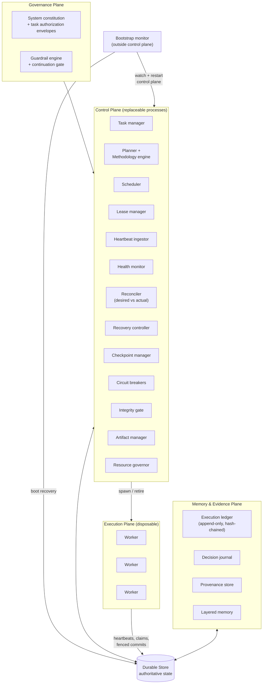

# 02 — Architecture

## 2.1 Layered view

AXOS is four planes over one durable store. Nothing else is load-bearing.

Key points:

- **The store is the only load-bearing component.** Every other box can die
  and be replaced. The store must therefore be crash-safe, transactional, and
  backed up. Its selection is the highest-stakes technology decision in this
  architecture (see 2.4).
- **Workers never talk to the control plane for truth.** They read jobs from
  the store, write heartbeats to the store, and commit outputs through fenced
  transactions against the store. If the entire control plane is down, workers
  with valid leases keep working; heartbeats accumulate; nothing is lost.
- **The bootstrap monitor is deliberately outside the control plane.**
  Something must watch the watchers; that something must not depend on what it
  watches. It is a minimal, dependency-free process supervised by the VM's
  init system, plus a boot-time recovery script. The regress terminates at the
  hosting platform (see `09-heartbeat-and-watchdog.md`).

## 2.2 Control plane — component responsibilities and boundaries

The proposed component list has been challenged: merged where two components
would share mutable state or duplicate decisions, split where one component
would hold two failure domains, and added where a gap existed.

| Component | Responsibility | Explicitly NOT responsible for |
|---|---|---|
| Task manager | Task lifecycle transitions (validated), desired-state declaration, viability evaluation | How work gets done (that's the graph) |
| Planner | Task model → methodology selection → execution graph construction | Executing the graph |
| Methodology engine | What counts as success, evidence, quality, completeness; progress expectations | Scheduling, workers |
| Scheduler | Graph → job instances → durable queue placement, resource-aware | Detecting failures (health monitor's job) |
| Lease manager | Atomic claims, renewals, expiry, fencing tokens | Deciding *what* to recover |
| Heartbeat ingestor | Durable recording of heartbeats; nothing else | Interpreting health |
| Health monitor | Evaluates process / execution / work health → health states | Taking recovery action |
| Reconciler | Computes desired−actual diff; emits repair actions; idempotent | Policy decisions (recovery controller's job) |
| Recovery controller | DETECT→CLASSIFY→DIAGNOSE→RECOVER→VERIFY→RESUME/ESCALATE; owns escalation ladder and budgets | Long-term desired state |
| Checkpoint manager | Create / verify / select-latest-known-good / rollback | Deciding *when* to checkpoint (task manager + policy) |
| Circuit breaker registry | Per-scope breaker state machines (service, stage, recovery-loop) | Deciding thresholds (policy config) |
| Guardrail engine (+ continuation gate) | Authorizes every state transition and worker action against the task's authorization envelope and system constitution | Task-specific rules (those live in the envelope) |
| Integrity gate | Finalization checklist; FINALIZED / BLOCKED / FAILED verdict | Packaging (artifact manager's job) |
| Artifact manager | Content-addressed storage, registration, validation pipeline, orphan reconciliation, packaging | Judging quality (validators do) |
| Resource governor | Quotas, pressure levels, throttling signals to scheduler | Business cost decisions (policy) |
| Task authorizer *(added)* | Admits tasks: validates authorization envelope, budgets, scope before PLANNED | — |
| Secrets broker *(added)* | Resolves secret *references* at worker start; secrets never enter the store, ledger, or logs | Storing task state |
| Upgrade coordinator *(added)* | Quiesce → backup → migrate → verify → resume protocol for OS upgrades | Day-to-day recovery |

**Merged (and why):**

- *State-transition validator* → folded into the store access layer as a
  **transition gate**: every writer (including the control plane itself) goes
  through one validated-transition API. A separate component would be a
  bottleneck everyone must trust but nobody can verify.
- *Continuation gate* → folded into the guardrail engine as a pre-transition
  check. "Should we continue?" is a guardrail question, not a separate
  service.
- *Progress monitor* → folded into the health monitor as the *execution
  health* axis. Progress without health context is meaningless, and two
  components computing "is it moving?" would disagree.

**Boundaries that matter:**

- The health monitor **never** restarts anything; it only classifies. The
  recovery controller **never** classifies from raw signals; it consumes
  health verdicts. This separation is what prevents a flapping detector from
  directly flapping workers.
- The reconciler is **stateless and idempotent**: given desired and actual, it
  emits the same repair set. It holds no memory of past repairs (the ledger
  does). It can be killed mid-loop safely.
- The recovery controller is the **only** component that escalates. No other
  component may decide "this needs a human".

## 2.3 Data flow: the lifecycle of a unit of work

```mermaid
flowchart LR
    T["Task AUTHORIZED"] --> P["Planner builds<br/>versioned graph"]
    P --> S["Scheduler materializes<br/>job instances"]
    S --> Q[("Durable queue<br/>(in store)")]
    Q --> L["Lease manager:<br/>atomic claim"]
    L --> W["Worker executes<br/>(heartbeats)"]
    W --> A["Artifact staging<br/>(content-addressed)"]
    A --> C["Fenced commit:<br/>artifact + job COMPLETE<br/>in one transaction"]
    C --> V["Validators"]
    V --> K["Checkpoint manager<br/>(verified points)"]
    K --> G["Integrity gate"]
    G --> F["FINALIZED"]
```

Every arrow crossing into the store is a validated, ledger-appended
transition. There is no step where "the worker knows something the store
doesn't" that matters: uncommitted worker knowledge is, by design,
**untrusted and recoverable**.

## 2.4 The durable store: required properties and options

The store is the one component whose failure is catastrophic, so its
requirements are stated as properties, not products:

1. **ACID transactions** with conditional writes (compare-and-swap) — for
   atomic claims and fenced commits.
2. **Crash safety** — a torn write must never leave half a transition.
3. **Ordered append** — the ledger needs a monotonic sequence.
4. **Store-side time** — lease timestamps use the store's clock, never the
   worker's (kills clock-skew races).
5. **Online backup + point-in-time restore** — for corruption and operator
   error.
6. **Checksums** — detect bit-rot/silent corruption (or add an integrity
   layer above the store).

| Option | Strengths | Weaknesses | Verdict |
|---|---|---|---|
| Embedded SQLite (WAL) | Crash-safe, zero ops, transactions, single file = trivial backup; plenty for single-VM throughput (thousands of txns/sec) | One writer at a time (fine here); no built-in replication; file must live on durable disk | **Recommended default** for the single-VM target |
| PostgreSQL | Real concurrency, replication, mature ops | Operational weight; overkill for v1 throughput | Recommended if/when multi-node |
| etcd / FoundationDB | Consensus, watches | Operational complexity an order of magnitude beyond the need | Rejected for v1 |
| Files-as-database (JSON dirs) | Simple | No atomicity across files; torn writes; exactly the failure mode we're designing against | **Rejected outright** |

Artifacts (bulk bytes) live on the filesystem, **content-addressed by hash**,
with their *metadata* in the store. This split is deliberate: the store stays
small and transactional; bytes are immutable so they need no transactions.

## 2.5 Deployment topology

- **v1: single VM.** Control-plane services as supervised processes (or one
  supervisor process hosting modules — but each module independently
  restartable and stateless, so "the supervisor" is not a SPOF; see
  `11-recovery-engine.md`). SQLite on a persistent volume. Boot script runs
  recovery before starting services.
- **v2 (if needed): multi-VM.** Postgres + shared artifact storage; control
  plane horizontally scaled; the store becomes the coordination point (leases
  already assume this). The architecture does not change — only the store
  implementation and the bootstrap monitor's scope.

## 2.6 What the architecture refuses to do

- No in-memory-only queues, schedulers, or registries that matter.
- No "the agent will remember" anywhere in a recovery path.
- No unbounded anything: retries, workers, queue depth, artifact size,
  log growth — every dimension has a bound and an overflow behavior.
- No silent degradation: degraded modes are explicit states, journaled, and
  visible in observability (`25-observability.md`).
