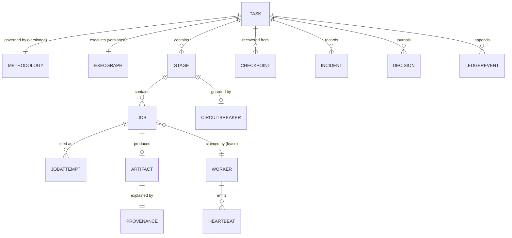

# 04 — Domain Model

The entities the store is authoritative for, their key fields, and their
relationships. This is a *logical* model — table names and column types are
implementation detail; the fields and invariants are architecture.

## Entities

### Task
The unit of human intent.
- `task_id` (PK), `objective` (text), `task_type`, `authorization_envelope`
  (JSON: allowed capabilities, domains, write scopes, external-action policy,
  budgets), `status` (lifecycle, see `05`), `methodology_id` + version,
  `graph_id` + version, `priority`, `created_by`, `created_at`,
  `min_os_version`, `parent_task_id?` (for replanned successors).

### Methodology
What "good" means for this task (see `16`). Referenced by version, never
mutated in place — a changed methodology is a new version, and the task
records which version governed which work (provenance).

### ExecutionGraph (versioned document)
Nodes (stages, job templates, gates, branches) + edges (dependencies,
conditions, recovery branches). Immutable versions; the task points at one.
Replanning creates a new version; the old one stays for provenance.

### Stage
A named phase of the graph for one task.
- `stage_id`, `task_id`, `name`, `status`, `desired_workers`,
  `concurrency_limit`, `checkpoint_policy`, `validation_standard`,
  `circuit_breaker_id?`.

### Job
The atomic unit of claimable work.
- `job_id`, `task_id`, `stage_id`, `kind`, `payload_ref` (input descriptor,
  content-addressed), `status` (see `07`), `priority`, `attempt` (count),
  `max_attempts`, `owner_worker_id?`, `lease_expires_at?`,
  `fencing_token` (monotonic int), `claimed_at?`, `not_before`
  (backoff scheduling), `idempotency_key` (deterministic: task+stage+unit),
  `result_artifact_id?`, `last_error?`, `quarantine_reason?`.

### JobAttempt
One execution try of a job. `attempt_id`, `job_id`, `worker_id`,
`fencing_token`, `started_at`, `ended_at?`, `outcome?`,
`staging_prefix` (where its artifacts went). Attempts are never deleted —
they are the audit trail of retries.

### Worker
A disposable execution instance.
- `worker_id`, `task_id?`, `capabilities[]` (with versions),
  `status` (see `06`), `health` (see `10`), `sandbox_policy`,
  `current_job_id?`, `fencing_token?`, `last_heartbeat_at?`,
  `resource_profile`, `created_at`, `retired_at?`.

### Lease
Not a separate table in v1 — it is the `(owner_worker_id,
lease_expires_at, fencing_token)` triple on the job row, mutated only by the
lease manager through atomic conditional updates. Treating it as a logical
entity keeps the claim/renew/expire/reclaim semantics in one place
(`11-recovery-engine.md`, `12-reconciliation.md`).

### Heartbeat
Durable record (time-series, retention-bounded): `worker_id`, `job_id?`,
`ts` (store time on ingest), `worker_state`, `current_operation`,
`progress_done`, `progress_total?`, `last_progress_ts`, `progress_rate`,
`attempt`, `resources{}`, `note?`. Heartbeats inform health; they are never
themselves completion evidence.

### Checkpoint
Verified recovery point (see `13`): `checkpoint_id`, `task_id`, `stage_id?`,
`ledger_tip_seq`, `completed_units[]`, `remaining_units[]`,
`artifact_manifest[{artifact_id, hash}]`, `input_version`, `schema_version`,
`methodology_version`, `capability_versions{}`, `os_version`,
`verification{status, verified_at, method}`, `supersedes?`.

### Artifact
Content-addressed output (see `19`, `24`): `artifact_id` (= content hash),
`task_id`, `kind`, `size`, `uri` (in artifact storage), `status`
(STAGING → VALIDATED → RELEASED → QUARANTINED), `producer{job_id,
worker_id, attempt}`, `provenance_id`, `validations[]`.

### Incident
Anything that triggered recovery, a breaker, or a safe stop: `incident_id`,
`task_id?`, `scope` (worker/job/stage/task/service), `failure_class`
(see `14`), `detection`, `classification`, `diagnosis`, `actions[]`,
`outcome`, `escalated_to?`, `ledger_refs[]`.

### CircuitBreaker
`breaker_id`, `scope` (service/stage/task/recovery-loop), `state`
(CLOSED/OPEN/HALF_OPEN), `config{threshold, window, cooldown}`,
`opened_at?`, `half_open_probe_job?`, `consecutive_failures`.

### Decision (journal entry)
See `21`: question, evidence, alternatives, selected, reason, confidence,
actor, timestamp — for consequential choices only.

### Approval (durable human-approval record — ADR-005)
`approval_id`, `task_id`, `stage_id?`, `job_id?`, `reason`,
`requested_action`, `evidence_refs[]`, `risk`, `options[]`, `deadline?`,
`checkpoint_id`, `on_timeout` (deny | pause | escalate),
`status` (PENDING → APPROVED | DENIED | EXPIRED), `decided_by?`,
`decided_at?`, `decision_reason?`, `graph_version` (scope binding).
A decision exists only as a row transition. Approvals survive VM restart
and are re-surfaced on boot; a replan superseding the graph node expires
pending approvals with reason.

### LedgerEvent
Append-only (see `20`): `seq` (monotonic), `ts`, `task_id?`, `type`, `actor`,
`payload`, `prev_hash`, `hash`.

### Budget / Quota
Per task and per system: `max_workers`, `max_concurrent_jobs`, `api_rps`,
`storage_bytes`, `max_cost`, `max_wallclock`. Consumed counters live in the
store and are updated transactionally with the actions that consume them.

## Relationships

## Cardinality and lifecycle notes

- A job belongs to exactly one stage and one task, forever. Replanning never
  moves a job; it creates new jobs in a new graph version.
- A worker serves one task at a time (isolation, `23`). Multi-task workers
  are forbidden in v1 — they entangle failure domains and lease accounting.
- `fencing_token` starts at 0 and increments on every claim/reclaim. It is
  the *only* ordering primitive for "who owns this job now".
- `idempotency_key` is deterministic from (task, stage, unit descriptor).
  Re-materializing a graph (e.g. after replan) with the same key does not
  duplicate the unit — the store rejects the second insert, and the
  reconciler links the existing job.
- Deletion: the store is append-friendly. Jobs, attempts, heartbeats (beyond
  retention), and ledger events are never hard-deleted except by explicit
  retention jobs, which are themselves ledger-appended and never touch
  checkpoints, released artifacts, or decisions.
