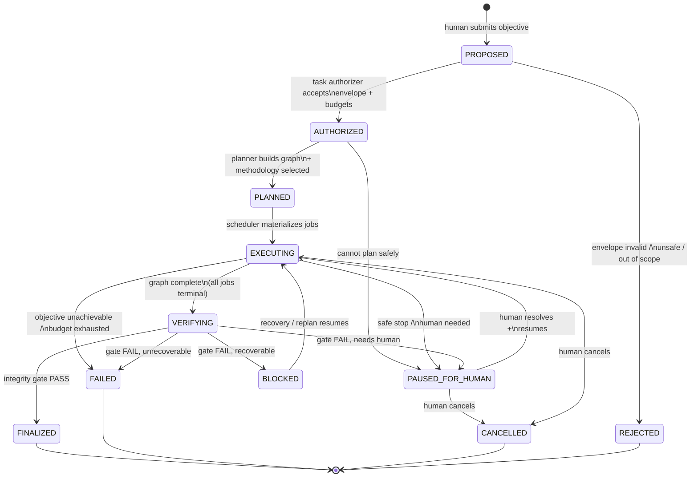
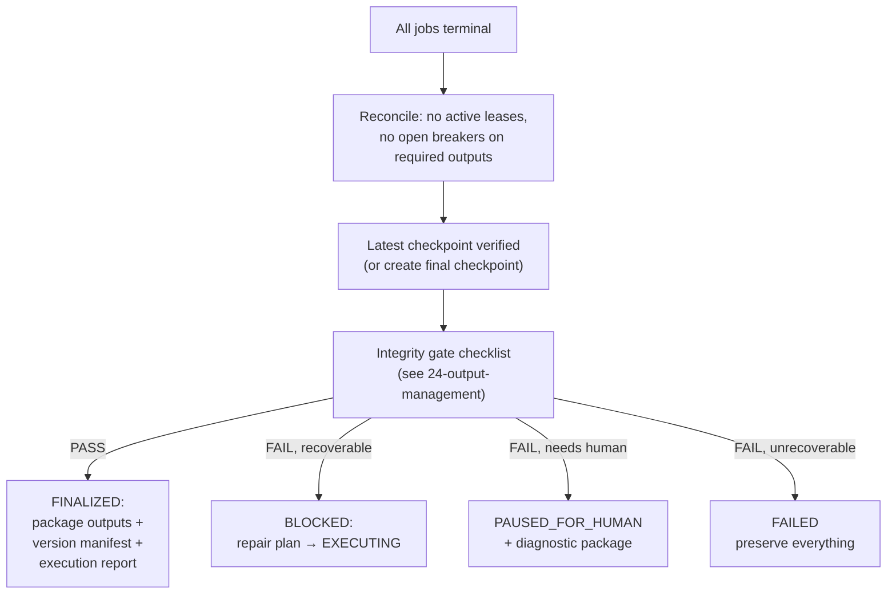

# 05 — Task Lifecycle

## States

## Transition rules

- Every transition goes through the transition gate: legal-transition check,
  guardrail authorization, ledger append. Illegal transitions are rejected and
  logged as incidents (a component attempting one is itself suspect).
- `EXECUTING → VERIFYING` requires: no non-terminal jobs, no active leases,
  no open breakers affecting required outputs. The task manager verifies this
  from the store, not from worker reports.
- `VERIFYING` is where the integrity gate runs (`24-output-management.md`).
  Completion of work is **not** completion of the task.
- `PAUSED_FOR_HUMAN` always carries a diagnostic package: what happened,
  evidence, what was preserved, options, and a recommended default. The task
  cannot leave this state except by explicit human action (resume with
  decision, replan approval, or cancel).
- **Pause stickiness (ADR-015, invariant I-17):** human-gated states survive
  VM restarts, supervisor restarts, and recovery cycles. Boot recovery
  reconciles and re-surfaces them; it never auto-resumes them. Auto-recovery
  is stood down for the paused scope until explicit human resume. A stop
  must hold.

## Human approvals (durable — ADR-005)

Graph HUMAN_APPROVAL nodes create durable `Approval` records (see
`04-domain-model.md`) rather than pausing the whole task: only the node's
downstream waits; independent stages continue. This is the normal-flow
mechanism, distinct from the exceptional PAUSED_FOR_HUMAN. Rules:

- A decision exists only as an `Approval` row transition (PENDING →
  APPROVED/DENIED/EXPIRED) with actor, reason, timestamp — never as agent
  memory or chat text alone.
- Pending approvals survive VM restart and are re-surfaced by boot
  recovery.
- Approvals are scoped to (task, graph version, checkpoint). A replan that
  supersedes the node expires pending approvals with reason; expired
  approvals authorize nothing.
- Default on-timeout: deny the requested action and safely pause the
  affected scope. Irreversible actions never default-approve.

## Waiting-on-condition vs waiting-on-judgment (ADR-014)

Pauses come in two kinds. **Waiting-on-condition** (breaker cooldown,
resource pressure clearing): auto-resumes when the condition clears, no
human needed. **Waiting-on-judgment** (ambiguous requirements,
irreconcilable state, budget decisions): waits for explicit human action
and carries an SLA (default: notification escalates if unanswered in 24h —
the *notification* escalates, never the action; the machine never acts on
judgment it doesn't have). Every pause states its kind, SLA, and
notification path in the diagnostic package.
- `FAILED` is terminal and honest: objective unachievable, budget exhausted
  with no safe path, or integrity gate failed unrecoverably. Everything is
  preserved for post-mortem; nothing is auto-retried out of FAILED.
- Replanning does not mutate the task's graph pointer silently: it creates a
  new graph version, journals the decision, and moves the task
  `BLOCKED/PAUSED_FOR_HUMAN → EXECUTING` only via the gate.

## Viability evaluation (the task-level watchdog)

While EXECUTING, the task manager runs a viability check on each tick:

1. Is the objective still achievable? (methodology validity, input freshness,
   external dependencies alive)
2. Is progress real? (completed units validated, not merely claimed)
3. Are failures bounded? (incident rate vs policy; breaker states)
4. Are resources within budget? (governor)
5. Is the graph still valid? (schema/version drift detected?)

Any "no" routes to: recover (if the plan is still valid), replan (if the plan
is invalid), or safe stop (if neither is safe). This is the Level-4 watchdog
from `09-heartbeat-and-watchdog.md`, and it is what prevents a task from
burning budget on a dead strategy.

## Cancellation and supersession

- Human cancellation: workers are told to stop at the next safe point
  (finish current atomic unit, do not start new claims); leases expire
  naturally; the task moves to CANCELLED after reconciliation confirms no
  active leases. Cancellation is graceful, not a kill signal — kill signals
  create UNCERTAIN jobs.
- If a task is replanned into a successor (new task_id, `parent_task_id`
  set), the parent moves to a terminal state and the child explicitly imports
  what it reuses (`23-task-isolation.md`). There is no "edit the task in
  place".

## Finalization / integrity flow

FINALIZED is the only state that means "the human can rely on this."
