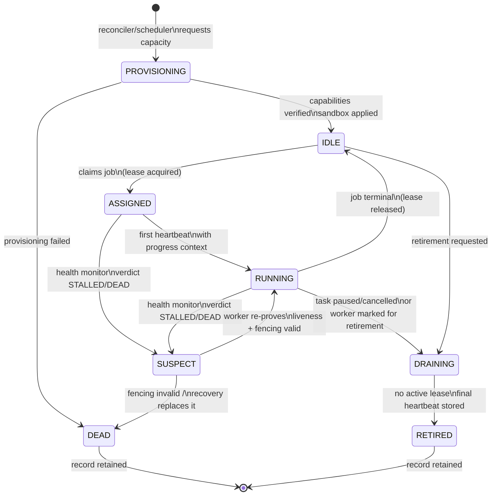

# 06 — Worker Lifecycle

Workers are disposable execution instances: a bundle of capabilities, a
sandbox policy, and a lease slot. They hold no authority. Everything they
"know" that matters is in the store.

## States

## Rules

- **Claim before work.** A worker in IDLE may not touch a job payload until
  the lease manager records the claim transactionally. Work done without a
  lease is uncommittable (the fenced commit will reject it).
- **Heartbeat or die (logically).** A RUNNING worker that stops heartbeating
  past the DEAD threshold is declared DEAD by the health monitor; its lease
  becomes reclaimable. The worker process itself may still be alive — but it
  no longer owns anything. If it later tries to commit with a stale fencing
  token, the commit is rejected and it must return to IDLE and re-claim.
  This is self-fencing: the worker enforces its own eviction.
- **SUSPECT is a verdict, not a guess.** Entered only on health-monitor
  classification (see `10-health-model.md`), never on a single missed
  heartbeat. Exit requires either re-proof (fresh heartbeat + valid fencing
  token + resumed progress) or replacement.
- **Self-fencing is enforced, not voluntary (ADR-003, Risk 4).** On
  lease-renewal failure or fencing-token invalidation, the supervisor
  terminates the worker's process group within one heartbeat interval. A
  fenced-out worker that doesn't yield is killed — it is by definition
  untrustworthy. `fenced_out_worker_seconds` is a first-class metric.
- **DRAINING is graceful.** The worker finishes its current atomic unit,
  commits if it holds a valid lease, releases the lease, and retires. Kill
  signals are a last resort because they manufacture UNCERTAIN jobs.
- **One task per worker** (v1). A worker never holds leases for two tasks.
  This keeps failure domains, budgets, and provenance clean.
- **Retirement is normal.** Workers retire after N jobs, T wall-clock time,
  or memory growth beyond threshold — long-lived workers accumulate state
  drift and silent corruption risk. The reconciler continuously replaces
  retirees to hold desired capacity.

## Worker record vs worker process

The *record* (in the store) is authoritative about the worker's lifecycle
state. The *process* is an implementation detail. After a VM restart, there
are no processes — only records, all of which the boot recovery marks
appropriately (anything not RETIRED/DEAD becomes DEAD-by-restart, leases
reclaimed; see `11-recovery-engine.md`). New processes are then provisioned
to meet desired state. This is why "the worker" can survive the death of
every worker: the role persists, the instances don't.

## Provisioning contract

A worker is not ASSIGNED/RUNNING until: capability versions verified against
the registry, sandbox policy applied, secrets resolved via the secrets broker
(by reference, never written to the worker's disk in recoverable form), and
a provisioning heartbeat recorded. A worker that fails provisioning is DEAD
with cause `provisioning_failed` — it never touches a job.
