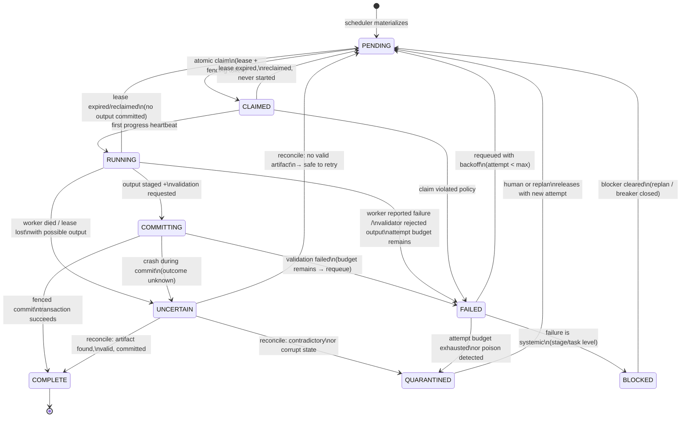

# 07 — Job Lifecycle

The job is the atomic unit of claimable work — and the place where
exactly-once *effect* is constructed out of at-least-once *execution*.

## States



## The fenced commit (the heart of correctness)

Completion is a single store transaction:

```
BEGIN
-- 1. Verify I still own this job
SELECT fencing_token FROM jobs WHERE job_id = ?  -- must equal my token
-- 2. Register the artifact (content-addressed; duplicate hash = no-op)
INSERT INTO artifacts (artifact_id = sha256(bytes), ...) ON CONFLICT DO NOTHING
-- 3. Mark complete, but ONLY if my token is still current
UPDATE jobs SET status='COMPLETE', result_artifact_id=?
  WHERE job_id=? AND fencing_token=? AND status IN ('COMMITTING')
-- 4. Append ledger event
COMMIT  -- or ROLLBACK on any failure
```

If the worker was partitioned and its lease was reclaimed (token bumped), step
1/3 sees a token mismatch → the transaction aborts → the worker's output
becomes an **orphan staged artifact**, which the artifact reconciler later
classifies (see `24-output-management.md`). It can never overwrite the
legitimate owner's result. This is how the design survives the nightmare
case: *worker A alive but slow, worker B reclaims, both produce output.*

## UNCERTAIN: the honest state

Entered when a worker disappears or a commit crashes *after* output may exist.
The system does **not** retry blindly. The UNCERTAIN reconciliation procedure:

1. **Inspect** staging area for this job+attempt: any artifacts?
2. **Validate** each found artifact: hash matches content? validators pass?
3. **Verify ownership**: does the artifact's recorded fencing token match the
   job's current token lineage, or a superseded one?
4. **Decide**:
   - Valid artifact + token lineage clean → commit it → COMPLETE. (The work
     happened; pretending it didn't would be the real duplication.)
   - No artifact, or artifact invalid → PENDING with attempt incremented.
     Safe to retry because nothing committable exists.
   - Two valid artifacts from different attempts (true duplicate execution)
     → keep first-committed, quarantine the other as an orphan with a
     provenance link. Never delete silently.
   - Artifact corrupt or contradictory → QUARANTINED + incident + journal
     entry. A human or replan decides.

## Attempt budgets and poison detection

- `max_attempts` per job (default from stage policy, e.g. 3). Each FAILED
  increments `attempt` and sets `not_before = now + backoff(attempt)` with
  jitter — the job is invisible to claimants until then.
- **Poison detection:** if a job fails the *same way* (same validator, same
  error class) on consecutive attempts, it is not a worker problem — it is a
  data/methodology problem. After 2 identical failures: QUARANTINED with
  `quarantine_reason=poison_suspected`, incident raised, stage health marked
  DEGRADED. Blind retry of poisoned inputs is how systems burn budgets.
- Attempts are first-class records (`JobAttempt`). "It failed 3 times" is
  answerable from the store, not from anyone's memory.

## Duplicate prevention

- `idempotency_key` = hash(task_id, stage_id, unit descriptor). Scheduler
  inserts are `ON CONFLICT DO NOTHING`; the existing job is returned.
- Double-claim is impossible: the claim is a single conditional UPDATE
  (`WHERE status='PENDING' AND (owner IS NULL OR lease_expired)`); the
  loser's UPDATE affects 0 rows.
- Double-commit is impossible: the commit's conditional UPDATE on
  `(job_id, fencing_token, status)` succeeds at most once; the artifact
  insert is idempotent on content hash.
