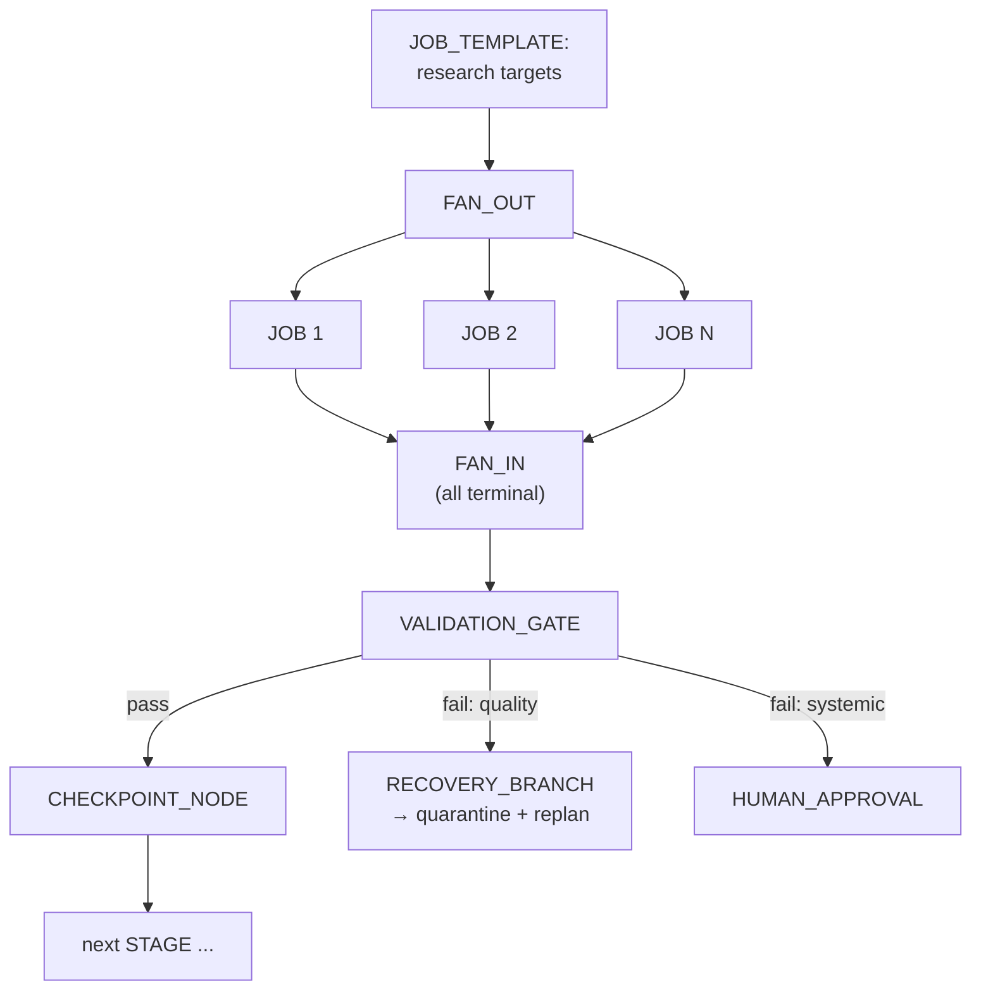

# 08 — Execution Graph

The execution graph is the task-specific plan: stages, jobs, dependencies,
and gates — persisted, versioned, and recoverable. It is a *document in the
store*, not a program in memory.

## Node types

| Node | Purpose |
|---|---|
| STAGE | Named phase with desired workers, concurrency, checkpoint policy, validation standard |
| JOB_TEMPLATE | Parameterized unit generator (fan-out source): "for each input unit matching X, materialize a job" |
| JOB | Materialized instance (see `07`) |
| FAN_OUT | Expands a template into N job instances at runtime (records the expansion mapping for provenance) |
| FAN_IN | Barrier: fires when all (or threshold) upstream jobs reach terminal states |
| VALIDATION_GATE | Runs validators over a defined output set; PASS/FAIL routes onward |
| CONDITIONAL | Branches on a predicate evaluated against durable state (never on worker opinion) |
| RECOVERY_BRANCH | First-class failure edge: `on JOB.failed[poison] → quarantine-flow` etc. |
| CHECKPOINT_NODE | Forces a verified checkpoint before proceeding |
| HUMAN_APPROVAL | Creates a durable `Approval` record gating only its downstream; decision exists only as a row transition (ADR-005) |
| FINALIZE | Triggers the integrity gate (`05`, `24`) |

## Edges

- **Depends-on** (hard): downstream materializes only after upstream terminal.
- **Condition**: evaluated at runtime against store state.
- **Recovery**: taken on classified failure; leads to quarantine, replan
  request, or safe stop — never to silent retry (retry is a job-level
  concern, `07`).
- **Data**: input descriptors are content-addressed references; a job's
  inputs are pinned hashes, so re-execution is deterministic in its inputs.

## Dynamic behavior

- Fan-out materialization is **idempotent** via `idempotency_key`
  (`07-job-lifecycle.md`): re-running expansion after a crash links existing
  jobs instead of duplicating them.
- The graph document is **immutable per version**. Runtime expansion state
  (which jobs were materialized from which template) lives in the store as
  facts, so a restarted scheduler resumes expansion exactly where it stopped.
- Conditional predicates may only reference durable state (job counts by
  status, validation rates, artifact manifests). A predicate referencing
  "worker says" is rejected at plan-validation time.

## Graph validation (at plan time)

The planner's graph is validated before the task leaves PLANNED:

1. No cycles in depends-on edges (recovery branches may loop back only to
   explicitly marked re-entry points with budgets).
2. Every JOB_TEMPLATE has a bounded expansion (max fan-out from policy) —
   an unbounded template is a resource-exhaustion bug at plan time.
3. Every path reaches FINALIZE or a terminal safe-stop node.
4. Every external-side-effect capability appears downstream of a
   HUMAN_APPROVAL or within an authorized envelope (`26`).
5. Recovery branches exist for every stage (default: quarantine + escalate).
6. HUMAN_APPROVAL nodes reference a durable `Approval` record (ADR-005) —
   the node gates its downstream; the decision is a row transition, never
   agent memory.

A graph failing validation keeps the task in AUTHORIZED with the violations
listed — it never executes.

## Persistence and recovery

- Graph versions are stored as documents; the task points at one version.
- Scheduler progress (materialized jobs, expansion cursors) is store state.
- After any restart, the scheduler reloads the graph version + materialization
  facts and continues. The graph "survives the VM disappearing" because it
  never lived in the VM's memory in the first place — the VM only held a
  cache of it.

## Replanning as graph versioning

Replanning = planner produces graph v(n+1) + decision journal entry (why the
old plan is invalid, evidence, alternatives). The task manager switches the
pointer only through the transition gate. In-flight jobs from v(n) are either
adopted (idempotency keys match new templates) or drained and superseded —
never silently redefined. Both versions remain for provenance.
