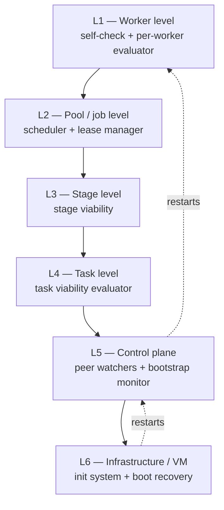

# 09 — Heartbeat and Watchdog Architecture

A missing heartbeat is *ambiguous*. It can mean a crashed worker, a hung
worker, a network partition, a dead supervisor, an overloaded machine, a
legitimate long operation, or a broken control channel. A design that maps
"missing heartbeat → restart worker" confuses all of these and will, sooner
or later, kill a healthy worker doing legitimate slow work — or restart-loop
a worker whose real problem is a poisoned input.

The architecture is therefore a pipeline, not a tripwire:

```
DETECT → CLASSIFY → DIAGNOSE → RECOVER → VERIFY → RESUME / ESCALATE
```

## 9.1 Heartbeat schema

Heartbeats are *signals*, durable and timestamped with **store time on
ingest** (worker clocks are untrusted):

```
worker_id, job_id?, task_id, worker_state, current_operation,
progress_done, progress_total?, last_progress_ts, progress_rate,
attempt, checkpoint_ref?, resources {cpu_pct, mem_mb, disk_mb},
note?
```

The fields that matter most are the progress fields: `progress_done`,
`last_progress_ts`, and `progress_rate`. A heartbeat that says "I'm alive"
while `last_progress_ts` never advances is the signature of a stall — which
is why liveness and progress are evaluated as **separate axes**
(`10-health-model.md`).

Expectations are not global constants. Each stage's methodology declares
`expected_heartbeat_interval`, `max_silence` (no progress), and
`min_progress_rate`. A 3-hour legitimate render and a 30-second API fetch get
different thresholds from the methodology that understands them
(`16-methodology-engine.md`). Generic timeouts are how watchdogs murder
healthy workers.

## 9.2 The six watchdog layers

> A component must not be the only mechanism responsible for detecting or
> recovering its own failure.



| Layer | Watches | Detects (examples) | Independent of |
|---|---|---|---|
| L1 | Individual worker (process/execution/work health) | crash, hang, stall, poisoned output rate | The worker itself (evaluator runs in control plane, from store data) |
| L2 | Job pool, queue, leases | expired leases, stuck queue, claim starvation, duplicate-claim attempts | Any single worker |
| L3 | Stage aggregate | validation-rate collapse, throughput vs plan, breaker states | The stage's workers |
| L4 | Whole task | objective unachievable, methodology invalid, budget burn | The execution machinery |
| L5 | Control-plane services | dead scheduler, wedged reconciler, ledger write stall | The services themselves (peer watchers + external bootstrap monitor) |
| L6 | VM/host | OOM, disk-full, kernel panic, host failure | Everything on the VM (watcher is the platform / init system) |

**How the regress terminates.** L5's bootstrap monitor is a minimal process
whose only dependencies are the init system and the store's disk. It does
not parse tasks, schedule, or heal — it only ensures control-plane processes
exist and restarts them (with backoff and alerting). If the VM dies, L6 (the
platform) restarts the VM; the boot script runs recovery from the store
*before* starting services (`11-recovery-engine.md`). There is no L7 inside
our scope: host-platform failure is declared out of scope and would be
covered by store backups + a standby VM (see `30-architecture-risks.md` for
the honest residual risk).

## 9.3 The pipeline in detail

**DETECT.** Layer-appropriate detectors emit *observations* (never verdicts):
"no heartbeat for 4× interval", "lease expired", "progress rate 0 for
max_silence", "validation failures 9/10 in window". Observations are
ledger-appended.

**CLASSIFY.** The health monitor maps observations to the failure taxonomy
(`14`) and health states (`10`): is this WORKER_FAILURE, JOB_FAILURE,
EXTERNAL_SERVICE_FAILURE? Is the worker DEAD, STALLED, or merely DEGRADED?
Classification uses methodology expectations and history (a worker that stalls
on every 3rd job is different from one that stalled once).

**DIAGNOSE.** Gather context before acting: recent heartbeats, attempt
history, sibling workers' health (one stalled worker = worker problem; all
stalled = service/stage problem), breaker states, resource pressure. The
output is a *diagnosis record* with confidence — low-confidence diagnoses
escalate rather than act.

**RECOVER.** The recovery controller selects the lowest effective rung of the
escalation ladder (`11`): e.g. wait-and-observe for a first DEGRADED, reclaim
lease for DEAD, replace worker for repeated STALLED, open breaker for
service-wide failure. Every action is budgeted.

**VERIFY.** After recovery, the controller confirms the *desired effect*,
not just that the action ran: the job is re-claimed and progressing, the
replacement worker heartbeats, the breaker probe succeeds. "Restart issued"
is not verification; "job progressing under new lease" is.

**RESUME / ESCALATE.** Verification success → resume normal operation and
close the incident. Verification failure or budget exhaustion → escalate one
rung (ultimately to safe stop / human). Every step appends to the ledger and
material decisions go to the decision journal.

## 9.4 What the naive design gets wrong

| Naive | This architecture |
|---|---|
| Missing heartbeat → restart | Missing heartbeat → observation → classify (could be network, supervisor, or legitimate slowness) |
| One global timeout | Per-stage expectations from the methodology |
| Watchdog restarts workers directly | Health monitor classifies; recovery controller acts — separation prevents flapping |
| Supervisor watches workers; nobody watches supervisor | L5 peer watchers + external bootstrap monitor; supervisors are stateless and replaceable |
| "Healthy" = "was healthy last time we looked" | Health requires fresh evidence; otherwise UNKNOWN (`10`) |
