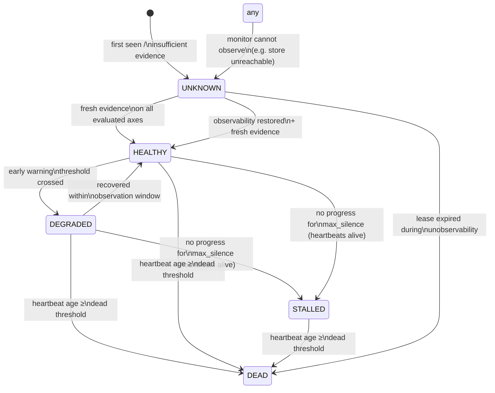

# 10 — Health Model

Health is evaluated on **three independent axes**. Collapsing them into one
"healthy/unhealthy" bit is how systems misdiagnose stalls as crashes and
poisoned data as broken workers.

## 10.1 The three axes

- **Process health** — is the worker process alive and communicating?
  Signal: heartbeat recency vs expected interval.
- **Execution health** — is the work actually advancing?
  Signal: progress delta vs methodology expectations
  (`max_silence`, `min_progress_rate`).
- **Work/output health** — is what it produces valid?
  Signal: validator pass rate over the worker's recent outputs; also
  malformed-output and schema-violation rates.

A worker can be process-HEALTHY, execution-STALLED, and work-HEALTHY (hung on
a slow dependency) — or process-HEALTHY, execution-HEALTHY, work-DEGRADED
(fast but wrong: the poisoned/misconfigured case). The recovery action
differs completely, which is why the axes stay separate until the composite
verdict.

## 10.2 Health states and transitions

States: `HEALTHY`, `DEGRADED`, `STALLED`, `DEAD`, `UNKNOWN`.

Transition rules (per axis, evaluated each tick):

| From → To | Condition |
|---|---|
| → HEALTHY | Fresh heartbeat within interval AND progress within expectations AND output pass-rate above threshold |
| → DEGRADED | Heartbeat age 2–5× interval, OR progress rate < 50% expected, OR output pass-rate dipping but above quarantine line |
| → STALLED | Heartbeats alive but `now − last_progress_ts > max_silence` (execution axis only; the defining stall signature) |
| → DEAD | Heartbeat age ≥ dead threshold (default 5× interval), OR worker process confirmed gone AND lease unrenewable |
| → UNKNOWN | The monitor itself cannot read heartbeats (store unreachable) or the worker was never observed; **UNKNOWN is reported as unknown, never coerced** |

Hysteresis: DEGRADED → HEALTHY requires a full clean observation window
(default 3 intervals), not a single good heartbeat — this damps flapping.
STALLED → HEALTHY requires observed progress, not just a heartbeat.

## 10.3 Composite verdict

The worker's overall health is the *worst* of the evaluated axes, with two
overrides:

1. If process = DEAD, overall = DEAD regardless of other axes (a dead
   process's last outputs are suspect until revalidated).
2. If work/output = DEGRADED-below-quarantine-line while execution is
   HEALTHY, overall = DEGRADED with flag `fast_but_wrong` — this routes to
   quarantine-the-worker (not restart-the-worker) in the recovery controller.

The composite verdict is what the recovery controller consumes. The per-axis
detail is what the diagnosis record carries, so escalation has evidence.

## 10.4 Stage and task health (aggregates)

- **Stage health** aggregates worker verdicts + stage-level signals:
  validation pass rate, throughput vs plan, breaker states, quarantine rate.
  A stage with 8/10 workers STALLED is not "8 worker failures" — it's one
  stage-level incident (likely external service or poisoned input batch).
- **Task health** is the viability evaluation (`05-task-lifecycle.md`):
  objective achievable, progress real, failures bounded, budget intact,
  graph valid.

Aggregation rule: **correlated failures escalate, they don't multiply.**
The incident raised is at the level where the correlation appears. This
prevents the classic cascade where one API outage generates 500 worker
incidents and 500 recovery actions.
