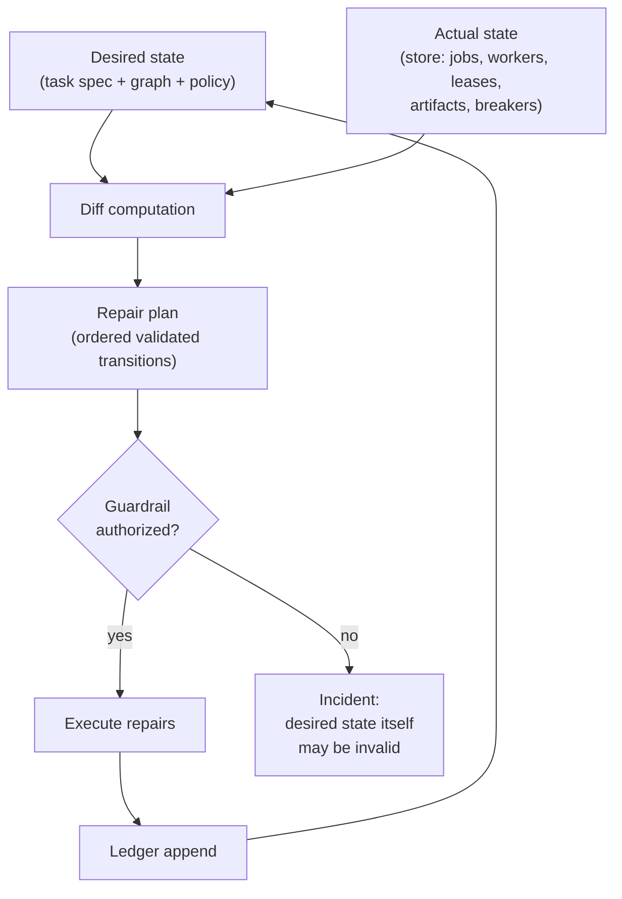

# 12 — Reconciliation (Desired State vs Actual State)

Reconciliation is the core architectural pattern. The machine does not "run"
work like a script; it declares desired state, measures actual state, and
repairs the difference — continuously, idempotently, and survivably.

## 12.1 The loop

The loop runs on a tick (default 10s, per-task tunable) and on events (lease
expiry, worker death, breaker change). It is **stateless**: given the same
desired and actual, it emits the same repair plan. It holds no memory of past
repairs — the ledger does. It can be killed mid-loop: repairs are individual
validated transactions, so a partial loop simply leaves a smaller diff for
the next tick.

## 12.2 What is compared

| Domain | Desired (from) | Actual (from) | Repair examples |
|---|---|---|---|
| Workers | Stage `desired_workers`, task budgets | Worker records by status | Provision / retire workers |
| Jobs | Graph: materialized jobs that should exist | Jobs by status | Materialize missing, requeue stuck |
| Leases | Every CLAIMED/RUNNING job has a live lease | `lease_expires_at` vs store time | Reclaim expired, bump fencing token |
| Checkpoints | Policy (e.g. every N units or M minutes) | Latest verified checkpoint age | Trigger checkpoint creation |
| Artifacts | COMPLETE jobs have RELEASED/VALIDATED artifacts | Artifact registry | Orphan classification, missing-artifact incident |
| Breakers | Policy thresholds | Breaker states | Open/close/half-open transitions |
| Budgets | Quotas | Consumed counters | Throttle, pause, escalate |

Example from the spec: desired `{acquisition: 2, extraction: 4, validation:
2}` vs actual `{2, 1, 0}` → repair plan: provision 3 extraction workers, 2
validation workers (subject to governor budgets). No human is involved; no
"orchestrator script" needed to notice.

## 12.3 Repair semantics

- Repairs are **convergent, not imperative**: the plan says "3 more extraction
  workers should exist", not "start worker X then Y". If the first tick
  provisions 2 and crashes, the next tick sees 2 and provisions 1 more.
- Repairs are **ordered by safety**: reclaim stale leases before provisioning
  (don't add workers to a pool full of dead leases); close breakers only via
  half-open probes; never delete — only transition forward.
- A repair the guardrail rejects (e.g. provisioning would exceed budget) is
  not silently dropped: it becomes an incident ("desired state unsatisfiable
  under current budgets") which may trigger throttling or escalation. The
  diff persists and stays visible in observability until resolved.
- **Lease-flap damping (ADR-017):** a job reclaimed N times in window W
  (default N=3, W=15min) is held BLOCKED with reason `lease_instability`
  until the partition settles, rather than instantly re-claimable. Churn
  without progress is not liveness.

## 12.4 Reconciler vs recovery controller

These are deliberately separate:

- The **reconciler** answers "what should exist that doesn't?" — structural,
  policy-driven, dumb, idempotent.
- The **recovery controller** answers "something broke; what do we do?" —
  diagnostic, escalating, budgeted.

They meet at the store: the reconciler may surface a diff the recovery
controller then diagnoses (e.g. "4 workers should exist, 0 do, and
provisioning keeps failing" → incident → escalate). Keeping them separate
prevents the reconciler from "healing" a symptom the controller is
investigating, and prevents the controller from owning routine capacity
management.

## 12.5 Anti-oscillation

- Repair plans carry a **cooldown per repair type**: e.g. don't re-provision
  the same stage more than once per 60s; don't flap a breaker.
- If the diff is not shrinking over K ticks despite repairs, the reconciler
  stops repairing that diff and raises an incident ("reconciliation not
  converging") — this is the structural backstop against repair loops, and
  it is what feeds the recovery controller's loop detector (`11`).
