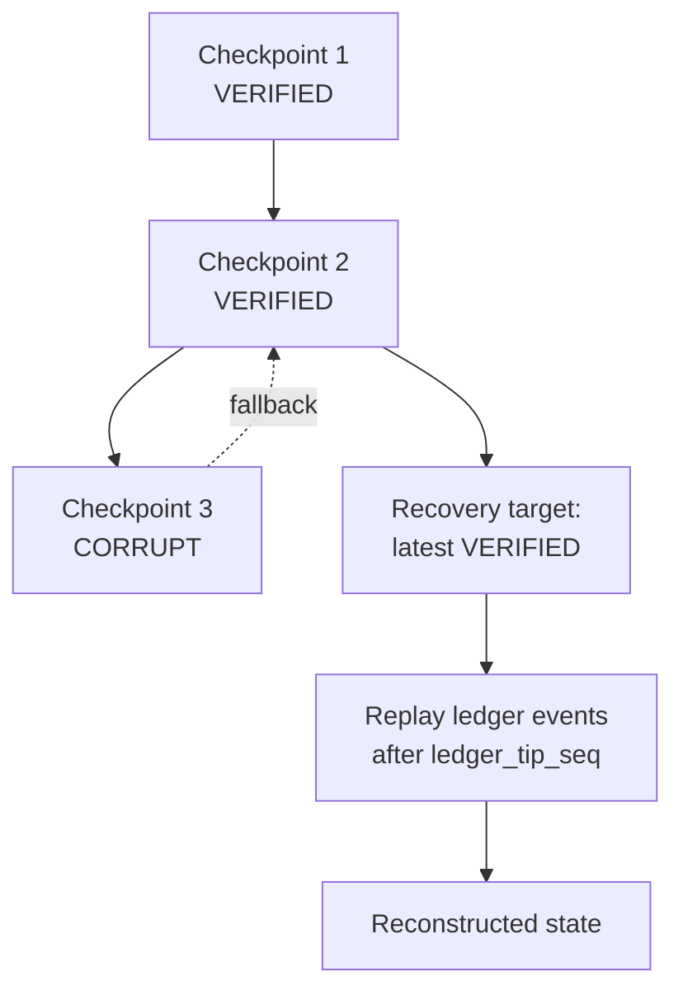

# 13 — Checkpoint Model

A checkpoint is not a timestamp. It is a **verified recovery point**: enough
durable information to reconstruct execution, proven correct before it is
trusted.

## 13.1 Checkpoint record

```
checkpoint_id, task_id, stage_id?, ledger_tip_seq,
completed_units[] (unit descriptors),
remaining_units[] (unit descriptors),
state_snapshot_ref (content-addressed blob for stage-specific state),
artifact_manifest[] {artifact_id, hash},
input_version, schema_version, methodology_version,
capability_versions{}, os_version,
created_at, verification {status, verified_at, method, sample[]},
supersedes (previous checkpoint_id)
```

`ledger_tip_seq` binds the checkpoint to an exact point in the execution
ledger: recovery replays from the checkpoint *plus* ledger events after the
tip, which is how we avoid losing work completed between the checkpoint and
the crash.

## 13.2 Creation triggers

- Policy: every N completed units or M minutes (per stage).
- Graph: CHECKPOINT_NODE in the execution graph.
- Events: before risky operations (replan, breaker opening, safe stop,
  human approval completion).
- Never: on a timer alone without verification capacity — an unverified
  checkpoint is worse than none, because it invites false confidence.

## 13.3 Verification (what makes it a recovery point)

A checkpoint becomes `VERIFIED` only after, and the verification is recorded
as a **receipt** (ADR-012):
`verification = {status: VERIFIED, verified_at, manifest: full,
ledger_chain: verified_to_tip,
revalidation: {rate, seed, count, passed}, version_coherence: ok}`.
No receipt, no trust — "VERIFIED" without one is not a valid state.

1. **Manifest integrity:** recompute hashes of all listed artifacts; every
   hash must match and every artifact must be reachable.
2. **Ledger consistency:** `ledger_tip_seq` must exist and its hash chain
   must verify up to the tip.
3. **Completeness cross-check:** every unit in `completed_units` must have a
   corresponding COMPLETE job and a manifest entry; every unit in
   `remaining_units` must not.
4. **Sample revalidation:** re-run validators on a random sample (default
   5%, min 3, seeded RNG for reproducibility) of the checkpoint's artifacts.
   Catches silent corruption the hashes can't see (hashes prove bits didn't
   change, not that the bits were ever right). **Release checkpoints
   (pre-FINALIZE) are always 100% revalidated — FINALIZE never rests on a
   sample.** Task types may tighten the interim rate but never silently
   loosen below default; loosening needs a journaled risk acceptance
   (ADR-012).
5. **Version coherence:** recorded versions must match the versions that
   actually produced the artifacts (provenance spot-check).

Failure at any step → checkpoint marked `CORRUPT` (never deleted — it's
evidence), incident raised, and the system falls back to the previous
verified checkpoint.

## 13.4 Latest-known-good selection and rollback



- Recovery target = highest `created_at` checkpoint with
  `verification.status = VERIFIED` for the task (optionally per stage).
- Rollback = restore `remaining_units`/`completed_units` from the checkpoint,
  adopt its artifact manifest as the expected set, then replay ledger events
  after its tip to recover post-checkpoint progress. Jobs completed after the
  tip but before the crash are recovered via UNCERTAIN reconciliation, not
  discarded.
- Rollback never deletes newer artifacts: anything produced after the
  checkpoint that validates is kept as an orphan-or-adopted artifact with
  provenance (`24`). Rolling back *state* must not destroy *evidence*.

## 13.5 Corruption handling

Corruption sources: torn writes (crash mid-checkpoint), bit-rot, operator
error, bug in the checkpointer. Defenses, in layers:

1. Checkpoints are written transactionally (single commit; no partial
   checkpoint is ever visible).
2. Manifest hashes detect content corruption on read.
3. Verification (13.3) runs before trust.
4. Retention keeps the last K verified checkpoints (default 5) plus every
   checkpoint tagged `release` — so a corrupted latest never strands the
   task.
5. If *all* checkpoints for a task are corrupt/unverifiable: the task cannot
   auto-recover. It goes PAUSED_FOR_HUMAN with the ledger (which is
   hash-chained and independently verifiable) as the reconstruction source.
   The ledger is the checkpoint of last resort — slower, but complete.

## 13.6 Cost control

Full verification is expensive. Policy knobs: verification sample rate,
checkpoint frequency, retention count. The tradeoff is explicit: cheaper
checkpoints = longer replay on recovery. Defaults bias toward safety
(checkpoint every 15 min or 100 units, 5% sample) and are tunable per task.
