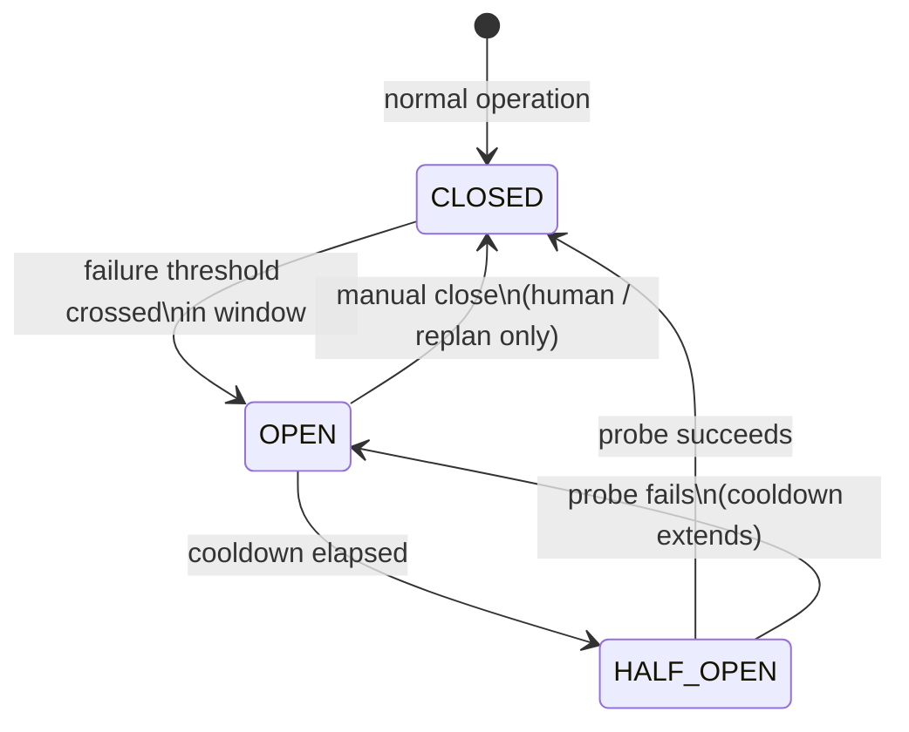

# 15 — Circuit Breakers

Repeated failure must eventually stop automatic retries. The circuit breaker
is the architectural mechanism that converts "keep trying" into "stop,
preserve, wait, probe, resume".

## 15.1 State machine



- **CLOSED:** traffic flows; failures counted in a rolling window.
- **OPEN:** affected work is *paused, not failed*. Jobs are moved to
  BLOCKED (breaker scope), state is checkpointed, an incident is recorded.
  No retries are attempted against the broken dependency — this is what
  prevents retry storms.
- **HALF_OPEN:** after cooldown, exactly one probe is allowed (a single
  canary job, or a synthetic health check for services). Success closes the
  breaker and drains the BLOCKED queue; failure re-opens with extended
  cooldown (exponential, capped).

## 15.2 Scopes

Breakers exist at four scopes, each with its own registry entry:

1. **External service** (e.g. `api.vendor.com`, image-generation backend):
   threshold = consecutive failures or error rate in window; probe = synthetic
   request or canary job.
2. **Stage**: threshold = validation-failure rate or worker-failure rate
   across the stage's workers; probe = one job through the full stage path.
   A stage breaker stops the stage, not the task.
3. **Recovery loop**: threshold = same incident signature N times in window
   W; this breaker pauses *automatic recovery itself* for that signature and
   forces escalation. This is the backstop against self-healing doing damage.
4. **Task**: threshold = incident rate or budget burn rate; opens only via
   the viability evaluation or human — a task breaker is effectively a safe
   stop with a defined resume condition.

## 15.3 Breaker configuration (policy, per scope)

```
failure_threshold, window_seconds, cooldown_seconds,
max_cooldown_seconds, probe_kind (synthetic|canary),
half_open_max_probes, notify_on_open
```

Defaults are conservative (e.g. service: 5 consecutive failures or 50% over
60s → open; cooldown 300s doubling to max 3600s). Thresholds are policy, not
code — they live in the task/stage config and are journaled when changed.

## 15.4 Interaction with recovery

- An OPEN breaker **suppresses** rungs 1–5 for affected jobs: retrying
  against a known-broken dependency is forbidden, not merely discouraged.
- Breaker transitions are ledger events and incidents. "Breaker opened for
  api.vendor.com after 7 consecutive failures" is first-class history.
- When a breaker opens, the checkpoint manager takes a checkpoint first
  (I-7: preserve before pausing).
- Recovery-loop breakers feed directly into escalation: when automatic
  recovery is paused for a signature, the only exits are replan or human.

## 15.5 What breakers do not do

- They don't fix anything. They buy time and prevent damage while the cause
  is addressed (or resolves itself).
- They don't replace classification. A breaker opens on *repeated failure*;
  the failure still needs a class (`14`) to determine whether the resume
  path is "probe and continue", "replan", or "human".
- Manual close exists but is journaled and requires the closer to state the
  evidence. Closing a breaker because "it should be fine now" without a
  successful probe is how outages recur.
