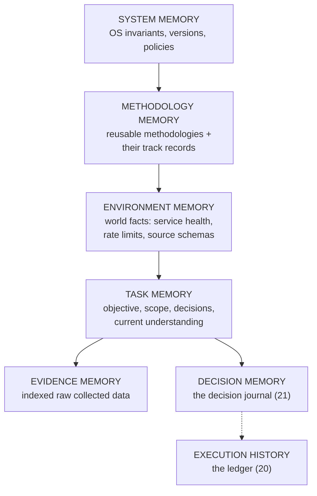

# 18 — Memory Model

Memory is layered. The critical separation: **execution state is
authoritative and lives in the store; memory is advisory.** Nothing in memory
may contradict the store, and no recovery path may depend on memory. Memory
exists to make the machine *smarter*, not to make it *correct*.

## 18.1 The seven layers

| Layer | Contents | Retention | Versioning |
|---|---|---|---|
| SYSTEM | Constitution, default policies, OS/capability versions, known-good configs | Permanent; changes journaled | Versioned; tasks pin |
| METHODOLOGY | Methodology records, per-methodology outcomes (gates passed/failed, validation rates) | Permanent; track records accumulate | Immutable versions |
| ENVIRONMENT | Service statuses, observed rate limits, source schema snapshots, DNS/API notes | TTL-bounded; refreshed by observation | Timestamped snapshots; old snapshots kept for forensics |
| TASK | Objective interpretation, scope notes, working hypotheses, open questions | Task lifetime + archive | Tied to task version |
| EVIDENCE | Raw collected data, indexed for retrieval | Task lifetime + policy (then archived or purged per data policy); PII-tagged evidence retention-bounded per ADR-010 | Content-addressed |
| DECISION | Journal entries (`21`) | Permanent | Append-only |
| EXECUTION HISTORY | Ledger events (`20`) | Permanent (retention job may archive, never silently delete) | Hash-chained |

Retention tiers (ADR-007): SYSTEM/METHODOLOGY/DECISION/EXECUTION HISTORY
are Tier 0 (permanent-hot); raw heartbeats and worker logs feeding these
layers are Tier 1 (bounded); ENVIRONMENT snapshots are TTL-bounded per
their own refresh rules.

## 18.2 Separation rules

1. **Historical knowledge ≠ current evidence.** Methodology memory ("research
   methodology v3 passed 12 gates") informs selection; evidence memory ("this
   source said X on Tuesday") is what claims are checked against. Never let a
   track record substitute for fresh evidence.
2. **World knowledge ≠ execution state.** Environment memory ("api.vendor.com
   was rate-limiting yesterday") feeds circuit-breaker *priors* and planner
   caution — but the breaker still opens only on observed failures, and the
   store is still the authority on whether jobs are BLOCKED.
3. **Memory never overrides the store.** If task memory says "we decided to
   use source A" but the ledger shows the decision was reversed, the ledger
   wins. Components must read the store for decisions, memory for context.
4. **Cross-task learning is explicit.** Methodology track records aggregate
   across tasks, but task evidence never leaks into another task's reasoning
   except through the explicit import protocol (`23`). No "I remember
   something from another task" shortcuts.

## 18.3 What memory is for, concretely

- The planner consults METHODOLOGY + ENVIRONMENT to choose approaches with
  good track records and avoid known-broken sources.
- The recovery controller consults ENVIRONMENT (is this service flaky
  lately?) during diagnosis — as a *prior*, not a verdict.
- The viability evaluation consults TASK + EVIDENCE to judge whether the
  objective is still achievable.
- Analytics (`25`) mine EXECUTION HISTORY + DECISION for operational
  improvement.

Memory makes the machine experienced. The store keeps it honest.
