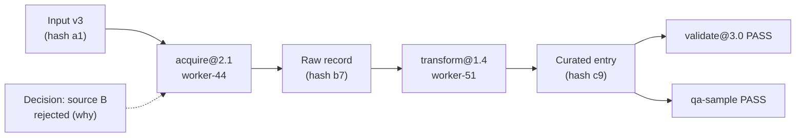

# 19 — Provenance Model

Every important result must be explainable: where it came from, what produced
it, what transformed it, what validated it, and which decisions shaped it.

## 19.1 Provenance record

```
provenance_id (= hash of canonical record),
artifact_id,
inputs[]        {artifact_id | external_ref, hash},
transform       {capability_id, version, config_hash, worker_id,
                 methodology_id+version, graph_version, job_id, attempt},
validations[]   {validator_id, version, result, at},
decisions[]     {decision_ids affecting this artifact},
parent_artifacts[],
created_at, os_version
```

`artifact_id` **is** the content hash (content-addressed). The provenance
record's own id is the hash of its canonical serialization — so provenance
itself is tamper-evident and deduplicating: two identical derivations have
identical provenance ids.

## 19.2 Provenance chains



Chains answer the required questions mechanically:

- *Where did this come from?* → walk `inputs[]` / `parent_artifacts[]`.
- *Which worker/methodology/transform?* → `transform{}`.
- *Which validation?* → `validations[]`.
- *Which decisions affected it?* → `decisions[]` → decision journal (`21`).
- *Which versions?* → every version field, plus `os_version`.

## 19.3 Rules

1. **Provenance is written at commit time**, in the same transaction as the
   fenced commit (`07`). An artifact without provenance cannot reach
   VALIDATED — the transition gate rejects it.
2. **External inputs are hashed too.** A fetched web page, an API response,
   an uploaded file: stored (or at least hashed with a retrievable copy per
   data policy) so "the source changed" is detectable and "what did we
   actually see" is answerable.
3. **Provenance is immutable.** Corrections create new artifacts with new
   provenance linking back (supersedes), never edits.
4. **Lineage queries are a first-class API**: `lineage(artifact_id)`,
   `descendants(artifact_id)`, `affected_by(decision_id)`. The integrity
   gate (`24`) uses these to prove completeness ("every released artifact
   has a valid chain").
5. **Cross-task imports** create provenance edges across task namespaces
   (`23`) — the link is explicit, version-pinned, and visible in both tasks'
   lineage.
