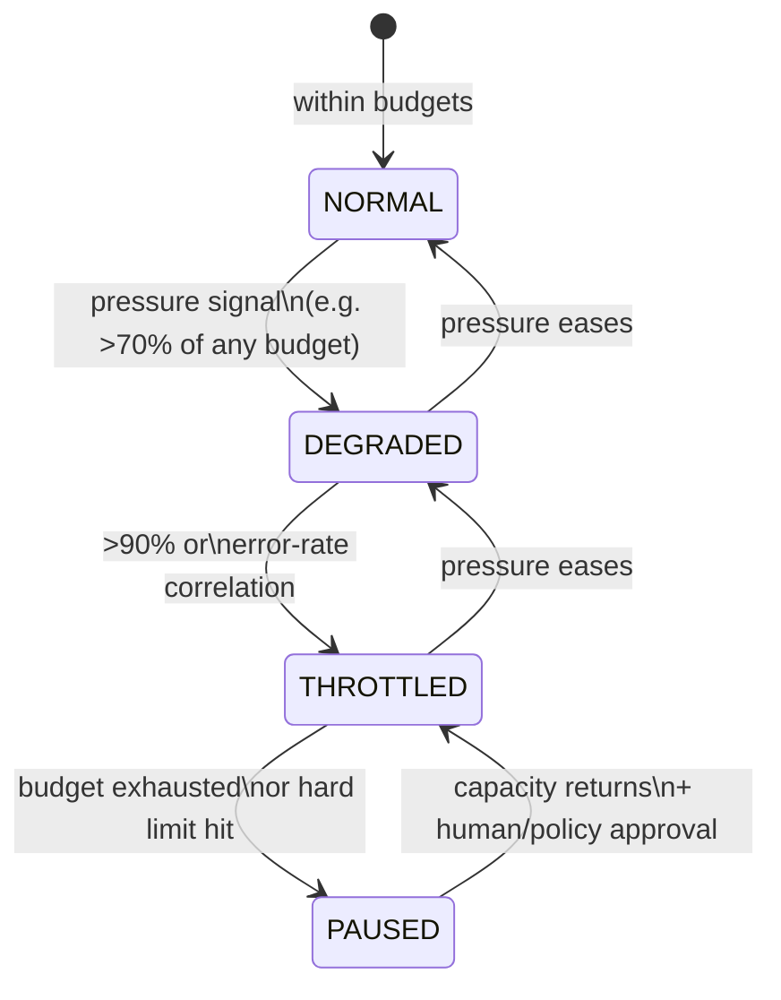

# 22 — Resource Governance

Dynamic spawning without governance is a fork bomb with extra steps. Every
consumable dimension has an explicit budget, a measured consumption, and a
defined behavior at the limit.

## 22.1 Governed dimensions

Per task and per system: `max_workers`, `max_concurrent_jobs`, `cpu_shares`,
`memory_mb`, `storage_bytes`, `api_requests_per_sec` (per service),
`max_wallclock`, `max_cost`. Consumption counters live in the store and are
updated **in the same transaction** as the consuming action (claim a job →
increment concurrent counter), so the count can't drift from reality.

## 22.2 Pressure levels

- **NORMAL:** scheduler places freely within budgets.
- **DEGRADED:** journaled; scheduler prefers cheaper placements, defers
  low-priority jobs, reduces fan-out parallelism. Visible in observability —
  never silent.
- **THROTTLED:** hard concurrency cuts (e.g. halve stage limits), no new
  worker provisioning, non-essential jobs (analytics, re-validation)
  suspended.
- **PAUSED:** no new claims; in-flight jobs drain gracefully; state
  checkpointed. Resume requires the pressure to clear *and* (for
  budget-exhaustion pauses) policy/human approval — auto-resume after
  hitting a cost cap would defeat the cap.

## 22.3 Feedback into scheduling and recovery

- The scheduler consults the governor **before** every placement decision.
  "Should exist" (reconciler) vs "may exist now" (governor): the reconciler
  declares desired state; the governor constrains the repair plan. The
  unsatisfied remainder stays a visible diff (`12`).
- Recovery actions consume budget too: a restart storm is a resource event,
  not just a logic event. Rung 7 (reduce concurrency) is often the correct
  response to pressure-correlated failures.
- **Resource exhaustion is never solved by "try harder".** Disk full →
  pause + alert, not delete-oldest-artifact (deleting evidence to make room
  is an integrity violation; retention policies handle cleanup explicitly).

## 22.4 Cost as a first-class budget

Where external services bill (APIs, image generation), cost accounting is
**mandatory** and `max_cost` is **required at authorization** for any task
using a billed capability — not optional (ADR-004). The task authorizer
rejects billed-capability tasks without a cap. Every billed capability
declares a `cost_profile`; consumption is recorded per job in the same
transaction as the consuming action (counters can't drift); the scheduler
estimates job cost from the profile and refuses placement that would exceed
the cap. Cost consumption is recorded per job (provenance-adjacent) so the
final report can say what the task cost. Hitting the cap pauses the task;
raising the cap is a human decision, journaled. Minimum accounting applies
even to unbilled work: per-job API calls, bytes, and wall-clock are
recorded regardless.
