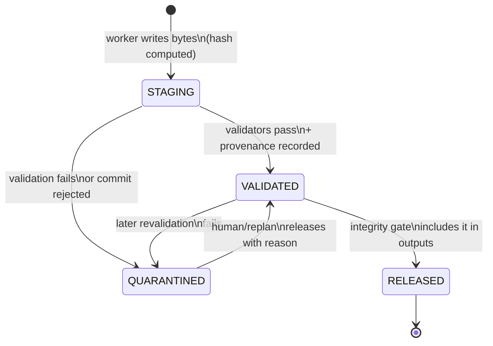
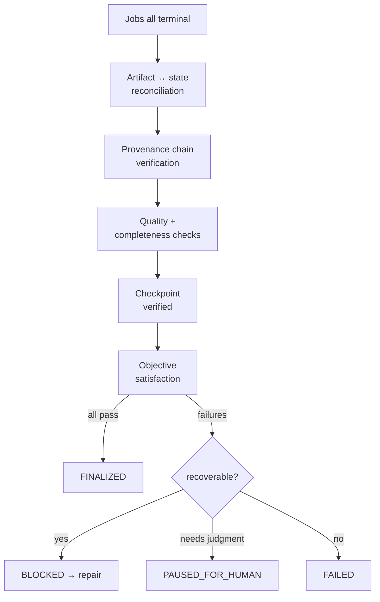

# 24 — Output and Artifact Management

The machine understands requested outputs as **artifacts**: typed,
content-addressed, validated, provenance-linked units. "The task produced a
report" means a RELEASED artifact of kind `report` exists, validates, and
chains to evidence — not that a worker said it wrote one.

## 24.1 Artifact lifecycle

- **Identity:** `artifact_id = sha256(canonical bytes)`. Identical bytes are
  identical artifacts — deduplication is free and corruption is detectable.
- **Registration** happens in the fenced commit transaction (`07`): artifact
  row + provenance + job COMPLETE, atomically.
- **Validation pipeline** per kind (JSON schema, CSV shape, image QA,
  report completeness): validators are versioned capabilities (`17`); their
  results are stored on the artifact, not just in a log.
- **Incomplete artifact detection:** expected outputs (from the task model)
  are reconciled against RELEASED artifacts — the same desired-vs-actual
  pattern (`12`) applied to outputs.

## 24.2 Orphan reconciliation

**Write durability (ADR-018):** artifact bytes are fsync'd before the commit
transaction references their hash. Hot (uncheckpointed) artifacts are
replicated to a second path until checkpointed. Artifact reconciliation runs
on every recovery event, not just the tick — and in boot recovery it
completes *before* checkpoint adoption drives resume (`11.4`).

Orphans arise from fenced-commit rejections and crashes: bytes in staging
with no committed artifact row, or artifact rows no job references. The
artifact manager's reconciliation (runs on tick + after recovery):

1. Hash and validate the orphan.
2. If valid and its job still needs output → adopt it (commit via the
   current lease holder's token, or mark the job UNCERTAIN→resolve).
3. If valid but superseded (another attempt committed) → keep as
   provenance-linked evidence, mark superseded. Never silently delete.
4. If invalid/corrupt → QUARANTINED with cause; bytes retained for
   forensics per retention policy.

The mirror case — job COMPLETE but artifact bytes missing — is an
INTEGRITY_FAILURE: the completion is distrusted, the job returns to
UNCERTAIN, and an incident is raised. State saying "artifact exists" while
the bytes are gone is exactly the lie the integrity gate exists to catch.

## 24.3 Packaging

Packaging (ZIP, dataset bundle, report PDF) is itself a job in the graph
with inputs = the RELEASED artifact manifest. The package is a new artifact
with provenance over its members — so "what's in this zip" is answerable
forever. Packaging never mutates members.

## 24.4 Final integrity gate

Execution completion ≠ task completion. Before FINALIZED, the gate verifies:

- [ ] Expected outputs exist (task model's output spec vs RELEASED set)
- [ ] Outputs validate (schema, kind-specific checks, fresh — not stale)
- [ ] Completeness accounting reconciles (units in = units accounted for:
      complete + quarantined-with-reason + explicitly excluded; no silent gaps)
- [ ] Provenance exists and chains verify for every released artifact
- [ ] Quality requirements passed (methodology's bar, with sampling evidence)
- [ ] Unresolved failures handled (every incident closed, escalated, or
      accepted-with-reason — none merely "open")
- [ ] Latest checkpoint verified (or final checkpoint created + verified)
- [ ] No non-terminal jobs, no active leases, no orphaned work
- [ ] Artifacts reconcile with state (no COMPLETE-without-bytes,
      no expected-without-artifact)
- [ ] Task objective actually satisfied (methodology's success criteria
      evaluated against evidence — not asserted)
- [ ] Version manifest complete (every version pinned: inputs, OS,
      methodology, capabilities, graph, schemas)

Verdict: **PASS → FINALIZED** (package + version manifest + execution/
recovery report). **FAIL** → BLOCKED (recoverable: repair plan),
PAUSED_FOR_HUMAN (needs judgment), or FAILED (unrecoverable) — each with
the specific checklist items that failed, never a bare "gate failed".

