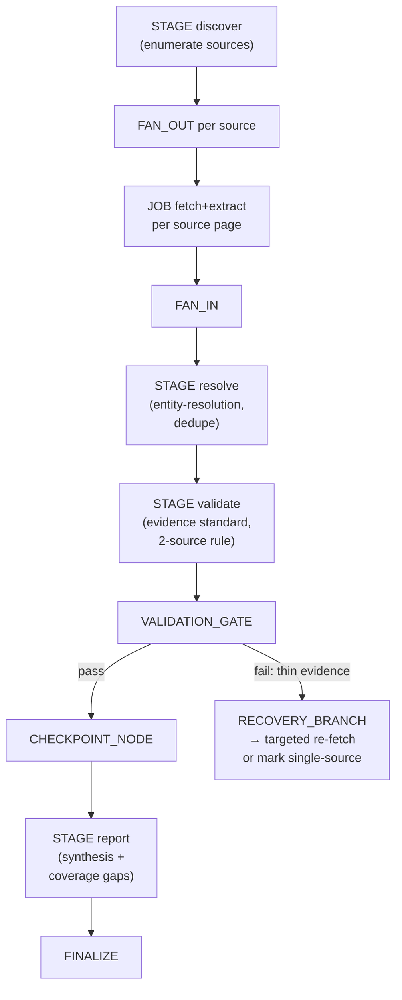
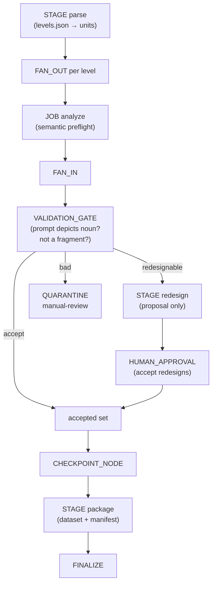
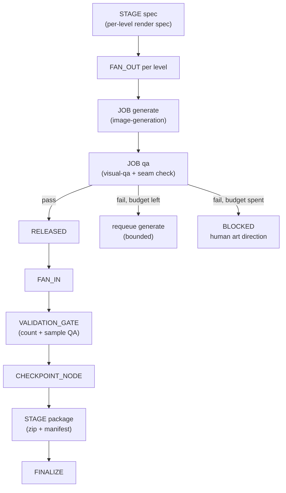

# 29 — Task Demonstrations (Generality Proof)

The same OS, three unrelated workloads. In each case the architecture is
unchanged — only the task configuration, methodology, capability
composition, and execution graph differ.

---

## TASK A — HubSpot partner technical-opportunity research

**Task interpretation.** Objective: "identify credible paid technical
opportunities with evidence and honest coverage." The planner parses this
into: enumerate candidate partners/opportunities, gather evidence per
candidate, validate credibility, reconcile duplicates, and report with
coverage gaps stated honestly. The task model declares outputs
(`report.md`, `opportunities.csv`, evidence bundle), freshness requirements,
and a strict honesty rule: unverifiable claims are reported as unverified,
never dropped silently or invented.

**Methodology** (`web-research/v3` adapted): question = "which paid technical
opportunities exist and what evidence supports each?"; success criteria =
every listed opportunity has ≥2 independent evidence sources or is marked
single-source; evidence standard = primary sources preferred (partner
directory listings, official docs), secondary marked as such; completeness =
enumeration rule over defined source layers (directories, job boards,
partner pages) with the layers listed in the report; quality bar = no
claim without a cited source; progress expectations = per-source fetch
budgets (slow sources get long `max_silence`, fast APIs short).

**Required capabilities.** ACQUIRE: web-discovery, structured-fetch,
enumeration, extraction. TRANSFORM: parsing, normalization, deduplication,
entity-resolution (same partner across sources). REASON: research-synthesis,
evidence-validation, source-reconciliation. VERIFY: schema-validation,
evidence-validation. OPERATE: packaging, reporting.

**Execution graph.**

**Workers.** Composed per stage: discover workers (web-discovery +
extraction), resolve workers (entity-resolution + dedupe), validate workers
(evidence-validation), one report worker (research-synthesis). Each
disposable; each fenced.

**Validation.** Per-candidate evidence rule enforced at the gate; CSV schema
validated; report checked for required sections including "coverage gaps
and limitations". A candidate with one source is not deleted — it is marked
single-source, because honest coverage includes uncertainty.

**Checkpoints.** After FAN_IN (raw evidence manifest), after resolve
(deduped entity set), after validate. Each verified with artifact hashes +
sample revalidation.

**Failure recovery.** Source down → service breaker for that domain;
affected fetch jobs BLOCKED, not failed; other sources continue. Schema
change on a directory → DATA_FAILURE → quarantine those units, adapt parser
via replan. Contradictory evidence on a partner → source-reconciliation
with both claims preserved and the conflict surfaced in the report.

**Integrity gate.** Report exists; every opportunity row has provenance to
evidence artifacts; coverage-gaps section present; no candidate silently
dropped (quarantined items listed with reasons); success criteria evaluated,
not asserted.

---

## TASK B — Word Pics content curation (levels.json → production dataset)

**Task interpretation.** Objective: transform a raw level list into a
curated, production-quality visual word-puzzle dataset. Interpretation:
analyze each level's semantics, accept / redesign / reject per a quality
methodology, never silently rewrite a bad prompt (quarantine for human
prompt decisions), and produce a dataset manifest with per-level lineage.

**Methodology** (`content-quality/v2`): question = "is this level solvable,
fair, and correctly described?"; quality standard with concrete acceptance
rules (noun must be depictable, prompt must depict the noun — not a
different object, no letter-fragment stubs); completeness = every input
level accounted for exactly once (accepted / redesigned / rejected /
manual-review); evidence = per-level verdict + reason; progress expectations
= fast per-unit analysis, so `max_silence` is short and stalls are caught
quickly.

**Required capabilities.** TRANSFORM: parsing, normalization, deduplication,
analysis. REASON: semantic-analysis, classification, quality-evaluation.
CREATE: rewriting (redesign proposals only — applied after approval, never
silent). VERIFY: consistency-check (prompt-vs-noun match). OPERATE:
packaging, reporting.

**Execution graph.**

**Workers.** Analysis workers (semantic-analysis + classification),
redesign workers (rewriting, proposal-only sandbox), QA workers
(quality-evaluation + consistency-check).

**Validation.** The prompt-vs-noun consistency check is the load-bearing
validator: a level whose prompt depicts a different object, or a
letter-fragment stub, fails closed into quarantine — the machine does not
"fix" it by rewriting, because silent rewriting is how datasets rot.

**Checkpoints.** After analysis fan-in (verdict manifest), after human
approval resolution, after packaging.

**Failure recovery.** Malformed level JSON → DATA_FAILURE → quarantine unit,
continue. Validator disagreement on a level → manual-review, not majority
vote. Human rejects a redesign → that level returns to quarantine with the
reason recorded; the pipeline does not re-propose it (loop detector).

**Integrity gate.** Dataset manifest reconciles: input count = accepted +
redesigned + rejected + manual-review, with zero unaccounted; every accepted
level has a verified prompt-noun consistency check; quarantined levels list
reasons; nothing was silently rewritten (provenance shows human approval
for every redesign).

---

## TASK C — Word Pics image generation (approved dataset → assets)

**Task interpretation.** Objective: generate production-quality claymation-
style image assets for every approved level. Interpretation: per-level render
jobs with a visual spec, automated seam/padding checks, QA sampling, bounded
regeneration, and blocked-level quarantine for human art direction — never
shipping an asset that fails QA to hit a count.

**Methodology** (`visual-asset-qa/v2`): question = "does this image depict
the level's noun, in-style, technically clean?"; quality standard =
subject match, style consistency, no seams, correct padding, correct
dimensions/format; completeness = one RELEASED asset per approved level;
evidence = per-asset QA record; progress expectations = long per-unit
renders, so `max_silence` is generous and stall detection uses progress
milestones (not wall-clock alone).

**Required capabilities.** CREATE: image-generation (configured with the
style spec + per-level prompt). VERIFY: visual-qa, consistency-check
(style drift detection). TRANSFORM: analysis (padding/seam detection).
OPERATE: artifact-management, packaging.

**Execution graph.**

**Workers.** Generator workers (image-generation), QA workers (visual-qa —
deliberately *separate* workers from generators, so QA is independent),
packaging worker.

**Validation.** Automated seam/padding checks on every asset; visual-QA
sampling with a style-consistency check against approved references;
regeneration bounded (default 3) then BLOCKED. The generator never grades
its own work — separation of CREATE and VERIFY capabilities is a
methodology requirement, because self-graded QA is how bad assets ship.

**Checkpoints.** Every N released assets (artifact manifest grows large;
checkpoints bound the re-verification cost), plus pre-packaging.

**Failure recovery.** Image backend down → service breaker; jobs BLOCKED,
not failed; resume on recovery. GPU/worker crash mid-render → UNCERTAIN →
staged partial inspected (partial renders never validate → requeue).
Style drift detected across a batch → stage breaker + methodology review
(spec may need tightening) — not "keep generating".

**Integrity gate.** One RELEASED asset per approved level (reconciled
against Task B's manifest via explicit import, `23`); every asset passes
seam/padding checks; QA sample passes; blocked levels listed with reasons;
package manifest matches released set.

---

## What the demonstrations prove

The OS never changed: same lifecycles, same lease/fencing/commit path, same
watchdog layers, same reconciliation, same gates. What changed per task:
the methodology (what good means), the capability composition (what workers
can do), the graph (how work is organized), and the validators (what's
checked). Generality comes from pushing all domain knowledge into those
four task-supplied structures — never into the machine.
